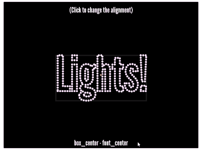

Bounding Box Aligned Text
=========================

A JavaScript module for positioning [p5.js](http://p5js.org/) text based on its bounding box. If you are looking to just straight to the API documentation, you'll want to start here: {@link BboxAlignedText}.

## Examples

Example 1 & 2 [(live demo)](https://www.mikewesthad.com/p5-bbox-aligned-text/examples/02-instance-p5-rotating-words/):

[](https://www.mikewesthad.com/p5-bbox-aligned-text/examples/02-instance-p5-rotating-words/)

Example 3 [(live version)](https://www.mikewesthad.com/p5-bbox-aligned-text/examples/03-global-p5-text-points/):

[](https://www.mikewesthad.com/p5-bbox-aligned-text/examples/03-global-p5-text-points/):

## Introduction

[p5.js](http://p5js.org/) is a wonderful creative coding library for JavaScript. The methods that p5.js provides for text placement (i.e. text anchor points) are based on a font's ascent, descent & baseline (see "Typography Metrics"). This is exactly what you want when laying out words as legible text.

Still, there are times when you would want to position text based on its exact bounding box. For example, you might have a particle system where words are particles that you want to position based on the center of the word and/or you want to do collision detection between words. (Demo code coming soon.)

That's what this module provides - an easy way to position (and rotate) p5.js text based on its exact bounding box.

## Typography Metrics

<br>[]](https://en.wikipedia.org/wiki/Typeface)

## Installation

### Standalone Script

If you just want the standalone script to drop into a project:

- Unminified: [bbox-aligned-text.js](http://mikewesthad.com/p5-bbox-aligned-text/dist/bbox-aligned-text.js)
- Minified: [bbox-aligned-text.min.js](http://mikewesthad.com/p5-bbox-aligned-text/dist/bbox-aligned-text.min.js)

### NPM

If you have [Node.js](https://nodejs.org/en/) & [NPM](https://www.npmjs.com/) (packaged with Node) installed, open a terminal in your project and run:

```
npm install p5-bbox-aligned-text
```

This will install the module in `./node_modules/p5-bbox-aligned-text`. You can then include the code into your project like this:

```
<script src="./node_modules/p5-bbox-aligned-text/dist/p5-bbox-aligned-text/bbox-aligned-text.min.js"></script>
```

Or, if you are using browserify with your project, you can import the constructor function in your JS via:

```
var BboxText = require("p5-bbox-aligned-text");
```
